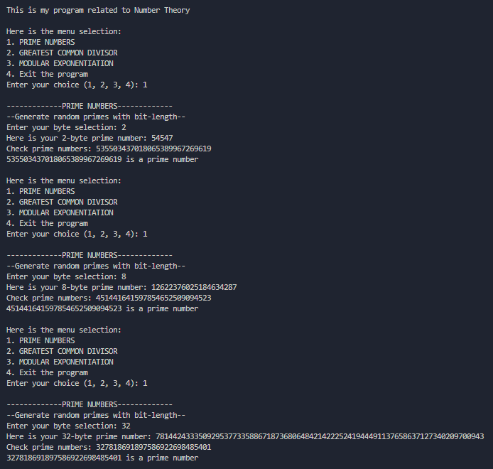
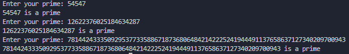
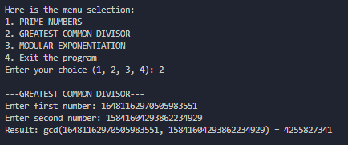
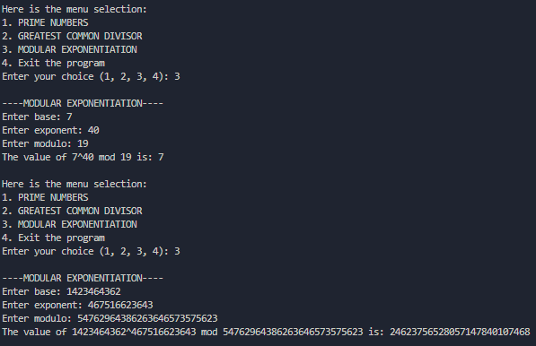

# Number Theory

## Giới thiệu chương trình
Chương trình sẽ thực hiện các yêu cầu sau:
1. Số nguyên tố:
- Sinh ngẫu nhiên các số nguyên tố có độ dài theo byte bất kỳ.
- Kiểm tra số nguyên bất kỳ có phải là số nguyên tố hay không.
2. Ước số chung lớn nhất:
Tính ước số chung lớn nhất của hai số nguyên “lớn” tùy ý.
3. Lũy thừa mô-đun:
Tính giá trị $a^x \mod p$.

## Cách khởi tạo chương trình
Mình sẽ hướng dẫn cách khởi tạo trên Linux Terminal.

1. Tạo thư mục đặt chương trình, ví dụ là LearnNumber (nếu có sẵn thì bỏ qua bước này)

    `mkdir LearnNumber`
2. Chuyển tới thư mục đó:
    
    `cd LearnNumber`
3. Clone repository này về:

    `git clone https://github.com/r1muru2006/Number-Theory.git`
4. Cài thư viện cần thiết:

    `pip install pycryptodome`
5. Chạy chương trình:

    `./Number-Theory/program`

Vậy là bạn đã hoàn tất việc khởi tạo chương trình.
## Giải thích phương thức hoạt động
Ở chương trình này mình sẽ khai báo thư viện `bigint` để làm việc trên những con số lớn.
>Phần 1: Số nguyên tố

Ở mục này, ta cần làm hai bước - 1 là tạo số ngẫu nhiên, 2 là kiểm tra tính nguyên tố.

Mình tạo số ngẫu nhiên bằng cách sử dụng random bằng bit (bit-level random), sau đó check prime bằng thuật toán Rabin-Miller, cụ thể là thuật toán đơn định (https://wiki.vnoi.info/algo/algebra/primality_check.md).

Hàm random bit để tạo số lẻ:
```cpp
bigint randomOddBigint(int bytes) {
    vector<unsigned char> data(bytes);
    for (int i = 0; i < bytes; i++) data[i] = rand() & 0xFF;

    if (bytes > 1)
        data[0] |= 0x80;
    data.back() |= 1;

    bigint result = 0;
    for (unsigned char c : data)
        result = result * to_bigint(256) + to_bigint(c);

    return result;
}
```
Hàm check random:
```python
bigint pow(bigint base, bigint exp, bigint mod) {
    bigint res = bigint(1);
    base %= mod;

    while (exp > bigint(0)) {
        if (exp % bigint(2) == bigint(1))
            res = (res * base) % mod;
        exp /= bigint(2);
        base = (base * base) % mod;
    }
    return res;
}

bool test(bigint a, bigint n, bigint k, bigint m){
    bigint mod = pow(a, m, n);
    bigint one = 1;
    if (mod == one || mod == n - one)
        return true;

    for (int l = 1; l < k; ++l){
        mod = (mod * mod) % n;
        if (mod == n - one)
            return true;
    }
    return false;
}

bool MillerRabin(bigint n){
    static vector<bigint> checkSet = {3, 7, 11, 13};

    bigint k = 0, m = n - to_bigint(1);
    while (m % to_bigint(2) == to_bigint(0)){
        m /= 2;
        k++;
    }

    for (bigint a : checkSet){
        if (a >= n) continue;
        if (!test(a, n, k, m))
            return false;
    }
            
    return true;
}
```
Khi xem qua phần code trên bạn sẽ thấy mình để `checkSet` rất ít số bởi vì ở hàm `genPrime`, mình sẽ check tính chia hết với những số nguyên tố nhỏ để đặt bộ lọc giúp bỏ bớt những số không thỏa và tăng tính chính xác của số nguyên tố hơn:
```cpp
const vector<bigint> smallPrimes = {
      3,   5,   7,  11,  13,  17,  19,  23,  29,  31,  37,  41,  43,  47,  53,
     59,  61,  67,  71,  73,  79,  83,  89,  97, 101, 103, 107, 109, 113, 127,
    131, 137, 139, 149, 151, 157, 163, 167, 173, 179, 181, 191, 193, 197, 199,
    211, 223, 227, 229, 233, 239, 241, 251, 257, 263, 269, 271, 277, 281, 283,
    293, 307, 311, 313, 317, 331, 337, 347, 349, 353, 359, 367, 373, 379, 383,
    389, 397, 401, 409, 419, 421, 431, 433, 439, 443, 449, 457, 461, 463, 467,
    479, 487, 491, 499, 503, 509, 521, 523, 541
};

bigint genPrime(int bytelength){
    int count = 0;
    while(true){
        bigint p = randomOddBigint(bytelength);
        bool isComposite = false;
        for (bigint prime : smallPrimes) {
            if (p == prime) {
                isComposite = false;
                break;
            }
            
            if (p % prime == to_bigint(0)) { 
                isComposite = true;
                break;
            }
        }
        if (isComposite)
            continue;
        if (MillerRabin(p))
            return p;
        count++;
        if(count == 10)
            cout << "Checked 10 random numbers!!!\n";
    }
}
```

Thật vậy, mình đã tạo vài số nguyên tố và kiểm tra thì nó cho ra kết quả với độ chính xác cao, tuy nhiên về hiệu suất thì với số bit càng lớn, tốc độ sinh số nguyên tố càng lâu.

Sau đây là 1 vài ví dụ sinh số nguyên tố 2 byte, 8 byte, 32 byte, kiểm tra số nguyên tố và cách mình double check những số này là bằng đoạn code python sử dụng thư viện `pycryptodome` :3

```python
# genPrime.py
from Crypto.Util.number import getPrime
for i in range(3):
    print(getPrime(90-i))
    
# 778910092719973123873611623
# 575482606982477339332775363
# 275939704016341849195231097

# checkPrime.py
from Crypto.Util.number import isPrime
for _ in range(3):
    p = int(input("Enter your prime: "))
    if isPrime(p):
        print(f"{p} is a prime")
    else:
        print(f"{p} is not a prime")
```
Ví dụ:



Check:



Full code mình để ở đây: [program.cpp](./program.cpp)

>Phần 2: Ước số chung lớn nhất

Ở phần tiếp theo này, mình sử dụng thuật toán Euclid với độ phức tạp là $O(\log(\min(x, y)))$ khi thực hiện tính toán $\gcd(x,y)$ và đây là script:
```cpp
#include <bits/stdc++.h>
#include "bigint.h"

using namespace std;

bigint myGCD(bigint a, bigint b) {
    if (a == to_bigint(0))
        return b;
    return myGCD(b % a, a);
}

int main() {
    bigint x, y;
    cout << "\n---GREATEST COMMON DIVISOR---\n";
    cout << "Enter first number: "; cin >> x;
    cout << "Enter second number: "; cin >> y;
    bigint res2 = myGCD(x, y);
    cout << "Result: gcd(" << x << ", " << y << ") = " << res2 << endl;
    return 0;
}
```
Ví dụ:


>Phần 3: Lũy thừa mô-đun

Để tính giá trị $a^x \mod p$ thì mình viết hàm `pow` sử dụng thuật toán nhân lũy thừa bằng bình phương để tính nhanh lũy thừa, sau đây là code:
```cpp
#include <bits/stdc++.h>
#include "bigint.h"

using namespace std;

bigint pow(bigint base, bigint exp, bigint mod) {
    bigint res = bigint(1);
    base %= mod;

    while (exp > bigint(0)) {
        if (exp % bigint(2) == bigint(1))
            res = (res * base) % mod;
        exp /= bigint(2);
        base = (base * base) % mod;
    }
    return res;
}

int main() {
    bigint b, e, p;
    cout << "\n----MODULAR EXPONENTIATION----\n";
    cout << "Enter base: "; cin >> b;
    cout << "Enter exponent: "; cin >> e;
    cout << "Enter modulo: "; cin >> p;
    bigint res3 = pow(b, e, p);
    cout << "The value of " << b << "^" << e << " mod " << p << " is: " << res3 << endl;
    return 0;
}
```
Ví dụ:



## Tham khảo:
- BigInt (https://github.com/rgroshanrg/bigint)
- Miller-Rabin in VNOI (https://wiki.vnoi.info/algo/algebra/primality_check.md)
- Miller-Rabin in Wiki (https://en.wikipedia.org/wiki/Miller%E2%80%93Rabin_primality_test)
